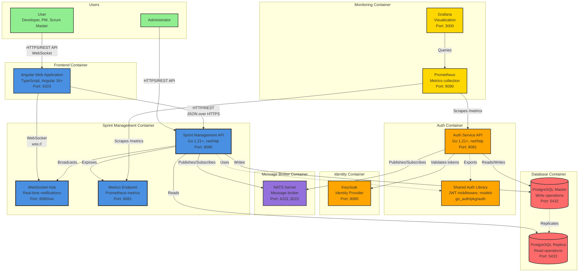

# C4 Model: Container Diagram

This diagram shows the major containers (applications and data stores) that make up the Sprint Management System.

## Container Diagram



## Container Details

### Frontend Container

#### Angular Web Application

**Technology**: TypeScript, Angular 16+, RxJS

**Responsibilities**:
- User interface rendering
- Client-side routing
- Form validation
- State management
- WebSocket client for real-time updates

**Key Features**:
- Responsive design
- Real-time updates
- Offline support (future)
- Progressive Web App (PWA) capabilities

**Communication**:
- REST API calls to Sprint Management API
- WebSocket connection for real-time notifications
- JWT token management

### Sprint Management Container

#### Sprint Management API

**Technology**: Go 1.21+, net/http, oapi-codegen, sqlc

**Responsibilities**:
- Work item CRUD operations
- Sprint management
- Dependency management
- Search and filtering
- Reporting and analytics
- Data import/export
- Audit logging

**Architecture**:
- Domain-driven design
- Layered architecture (handlers → services → repositories)
- OpenAPI-first development
- Type-safe SQL with SQLC

**Endpoints**:
- `/api/v1/workitems/*` - Work item operations
- `/api/v1/sprints/*` - Sprint operations
- `/api/v1/comments/*` - Comment operations
- `/api/v1/reports/*` - Reporting endpoints
- `/api/v1/admin/*` - Administrative operations
- `/health/live` - Liveness probe
- `/health/ready` - Readiness probe

#### WebSocket Hub

**Technology**: Go WebSocket library (gorilla/websocket)

**Responsibilities**:
- Manage WebSocket connections
- Room-based broadcasting
- Message routing
- Connection lifecycle management

**Features**:
- JWT authentication for connections
- Automatic reconnection support
- Ping/pong keep-alive
- Room subscriptions (sprints, projects)

#### Metrics Endpoint

**Technology**: Prometheus client library

**Responsibilities**:
- Expose application metrics
- Custom business metrics
- Health check endpoints

**Metrics**:
- HTTP request metrics
- Database query metrics
- NATS message metrics
- Business metrics (velocity, cycle time)

### Auth Container

#### Auth Service API

**Technology**: Go 1.21+, net/http

**Responsibilities**:
- JWT token validation
- User synchronization from Keycloak
- User profile management
- NATS-based service communication

**Endpoints**:
- `/api/v1/auth/validate` - Token validation
- `/api/v1/users/*` - User management
- `/health/live` - Liveness probe
- `/health/ready` - Readiness probe

#### Shared Auth Library

**Technology**: Go package (go_auth/pkg/auth)

**Responsibilities**:
- JWT validation middleware
- User context extraction
- Auth client for service-to-service calls
- Shared models and types

**Exported Packages**:
- `middleware` - HTTP middleware
- `models` - User and JWT models
- `client` - Auth service client
- `types` - Request/response types

### Identity Container

#### Keycloak

**Technology**: Keycloak 22+, Java

**Responsibilities**:
- User authentication
- JWT token issuance
- User management
- Single sign-on (SSO)
- Identity federation

**Configuration**:
- Realm: `sprint-management`
- Client: `sprint-client`
- Token expiration: 30 minutes
- Refresh token expiration: 24 hours

### Message Broker Container

#### NATS Server

**Technology**: NATS 2.10+

**Responsibilities**:
- Message routing
- Publish/subscribe patterns
- Request/response patterns
- Message persistence (JetStream)

**Ports**:
- 4222: Client connections
- 8222: HTTP monitoring

**Subject Patterns**:
```
sprint.{trace_id}.{resource}.{action}.{status}
auth.{trace_id}.{action}.{status}
```

### Database Container

#### PostgreSQL Master

**Technology**: PostgreSQL 15+

**Responsibilities**:
- Handle all write operations
- Transaction management
- Data integrity enforcement
- Replication to replica

**Schemas**:
- `sprint_management` - Application data
- `auth` - User data

**Configuration**:
- Max connections: 200
- Shared buffers: 256MB
- Work mem: 16MB

#### PostgreSQL Replica

**Technology**: PostgreSQL 15+

**Responsibilities**:
- Handle read operations
- Reduce load on master
- Provide read scalability

**Replication**:
- Streaming replication
- Asynchronous mode
- Automatic failover (with Patroni)

### Monitoring Container

#### Prometheus

**Technology**: Prometheus 2.x

**Responsibilities**:
- Scrape metrics from services
- Store time-series data
- Alert evaluation
- Query interface

**Scrape Targets**:
- Sprint Management API: `http://sprint-service:8081/metrics`
- Auth Service: `http://auth-service:8081/metrics`
- NATS: `http://nats:8222/metrics`
- PostgreSQL Exporter: `http://postgres-exporter:9187/metrics`

#### Grafana

**Technology**: Grafana 9.x

**Responsibilities**:
- Metrics visualization
- Dashboard management
- Alerting
- User management

**Dashboards**:
- Service overview
- Database performance
- NATS messaging
- Business metrics

## Communication Patterns

### Synchronous Communication

#### HTTP/REST

```
Frontend → Sprint API
- Protocol: HTTPS
- Format: JSON
- Authentication: JWT Bearer token
- Timeout: 30 seconds
```

#### WebSocket

```
Frontend ↔ WebSocket Hub
- Protocol: WSS (WebSocket Secure)
- Format: JSON messages
- Authentication: JWT in query parameter
- Keep-alive: 30 second ping/pong
```

#### Database Queries

```
Sprint API → PostgreSQL
- Protocol: PostgreSQL wire protocol
- Connection pooling: 25 max connections
- Timeout: 30 seconds
- Prepared statements for security
```

### Asynchronous Communication

#### NATS Messaging

```
Sprint API ↔ Auth API
- Protocol: NATS
- Format: JSON messages
- Pattern: Request/Response
- Timeout: 5 seconds
- Retry: 3 attempts with exponential backoff
```

**Example Message Flow**:
```
1. Sprint API publishes: auth.{trace_id}.validate.request
2. Auth API subscribes to: auth.*.validate.request
3. Auth API processes and publishes: auth.{trace_id}.validate.response
4. Sprint API receives response
```

## Data Flow

### Write Operations

```
1. Frontend sends POST/PUT/DELETE request
2. Sprint API validates JWT via Auth Service (NATS)
3. Sprint API validates business rules
4. Sprint API writes to PostgreSQL Master
5. Sprint API publishes notification (NATS)
6. WebSocket Hub broadcasts to connected clients
7. PostgreSQL Master replicates to Replica
```

### Read Operations

```
1. Frontend sends GET request
2. Sprint API validates JWT via Auth Service (NATS)
3. Sprint API reads from PostgreSQL Replica
4. Sprint API returns data to Frontend
```

### Real-time Notifications

```
1. Work item updated via API
2. Sprint API publishes notification to NATS
3. WebSocket Hub receives notification
4. WebSocket Hub broadcasts to room subscribers
5. Connected clients receive real-time update
```

## Deployment Configuration

### Resource Requirements

#### Sprint Management API
- CPU: 500m (request), 2000m (limit)
- Memory: 512Mi (request), 2Gi (limit)
- Replicas: 3 (min), 10 (max)

#### Auth Service
- CPU: 250m (request), 1000m (limit)
- Memory: 256Mi (request), 1Gi (limit)
- Replicas: 2 (min), 5 (max)

#### PostgreSQL Master
- CPU: 1000m (request), 4000m (limit)
- Memory: 2Gi (request), 8Gi (limit)
- Storage: 100Gi SSD

#### PostgreSQL Replica
- CPU: 500m (request), 2000m (limit)
- Memory: 1Gi (request), 4Gi (limit)
- Storage: 100Gi SSD

#### NATS Server
- CPU: 250m (request), 1000m (limit)
- Memory: 256Mi (request), 1Gi (limit)
- Replicas: 3 (clustered)

### Health Checks

#### Liveness Probes
```yaml
livenessProbe:
  httpGet:
    path: /health/live
    port: 8080
  initialDelaySeconds: 30
  periodSeconds: 10
  timeoutSeconds: 5
  failureThreshold: 3
```

#### Readiness Probes
```yaml
readinessProbe:
  httpGet:
    path: /health/ready
    port: 8080
  initialDelaySeconds: 5
  periodSeconds: 5
  timeoutSeconds: 3
  failureThreshold: 3
```

## Security

### Network Security

- All external communication over HTTPS/WSS
- Internal service communication over private network
- Database access restricted to application services
- NATS authentication enabled

### Authentication & Authorization

- JWT tokens for API authentication
- Token validation via Auth Service
- Role-based access control (RBAC)
- Service-to-service authentication via NATS

### Data Security

- Passwords hashed with bcrypt
- Sensitive data encrypted at rest
- TLS for data in transit
- Database connection encryption

## Scalability

### Horizontal Scaling

- Sprint API: Stateless, scales horizontally
- Auth API: Stateless, scales horizontally
- WebSocket Hub: Sticky sessions required
- NATS: Clustered for high availability

### Vertical Scaling

- Database: Increase resources for complex queries
- NATS: Increase resources for high message throughput

### Caching Strategy

- Application-level caching for read-heavy data
- Database query result caching
- CDN for static frontend assets

## Related Diagrams

- [System Context](c4-system-context.md): High-level system overview
- [Component Diagram](c4-component.md): Internal component structure
- [Sequence Diagrams](sequence-work-item-creation.md): Detailed interaction flows
