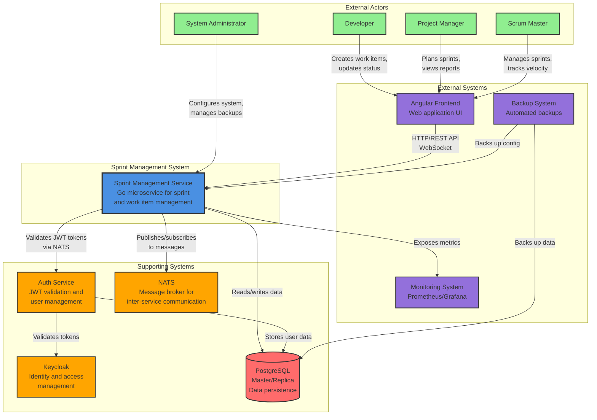

# C4 Model: System Context Diagram

This diagram shows the Sprint Management System in the context of its users and external systems.

## System Context

## System Responsibilities

### Sprint Management Service (Primary System)

**Purpose**: Core business logic for sprint and work item management

**Responsibilities**:
- Work item lifecycle management (create, update, delete, restore)
- Sprint planning and tracking
- Dependency management between work items
- Real-time notifications via WebSocket
- Search and filtering
- Reporting and analytics
- Data import/export
- Audit logging

**Technology**: Go 1.21+, OpenAPI-first design, SQLC for database access

### Supporting Systems

#### Auth Service

**Purpose**: Centralized authentication and authorization

**Responsibilities**:
- JWT token validation
- User synchronization from Keycloak
- User profile management
- Role-based access control

**Communication**: NATS messaging with Sprint Management Service

#### Keycloak

**Purpose**: Identity and access management

**Responsibilities**:
- User authentication
- JWT token issuance
- Single sign-on (SSO)
- User federation

**Integration**: Via Auth Service

#### PostgreSQL

**Purpose**: Primary data store

**Responsibilities**:
- Persistent storage of all application data
- Master/replica configuration for read/write separation
- Transaction management
- Data integrity enforcement

**Schemas**:
- `sprint_management`: Application data
- `auth`: User and authentication data

#### NATS

**Purpose**: Message broker for inter-service communication

**Responsibilities**:
- Asynchronous messaging between services
- Request/response patterns
- Event broadcasting
- Message persistence (JetStream)

**Subject Patterns**:
- `sprint.{trace_id}.{resource}.{action}.{status}`
- `auth.{trace_id}.{action}.{status}`

### External Systems

#### Angular Frontend

**Purpose**: User interface for the system

**Responsibilities**:
- User interaction and experience
- Real-time updates via WebSocket
- Data visualization (charts, reports)
- Form validation

**Communication**: HTTP/REST API and WebSocket

#### Monitoring System

**Purpose**: System observability and alerting

**Responsibilities**:
- Metrics collection (Prometheus)
- Visualization (Grafana)
- Alerting on anomalies
- Performance tracking

**Integration**: Prometheus metrics endpoint

#### Backup System

**Purpose**: Data protection and disaster recovery

**Responsibilities**:
- Automated database backups
- Configuration backups
- Backup retention management
- Disaster recovery procedures

**Integration**: Direct database access and file system

## User Personas

### Developer

**Goals**:
- Create and update work items
- Track work progress
- Collaborate with team members
- View work item dependencies

**Primary Use Cases**:
- Create story/defect
- Update work item status
- Add comments
- View sprint backlog

### Project Manager

**Goals**:
- Plan and organize work
- Track project progress
- Generate reports
- Make data-driven decisions

**Primary Use Cases**:
- Create epics and stories
- Plan sprints
- View reports and analytics
- Export data

### Scrum Master

**Goals**:
- Facilitate sprint ceremonies
- Track team velocity
- Remove blockers
- Optimize team performance

**Primary Use Cases**:
- Create and manage sprints
- View burndown charts
- Track velocity
- Manage dependencies

### System Administrator

**Goals**:
- Ensure system reliability
- Manage backups
- Monitor performance
- Troubleshoot issues

**Primary Use Cases**:
- Configure system
- Create backups
- Monitor metrics
- Manage users

## Integration Patterns

### Synchronous Communication

- **Frontend ↔ Sprint Service**: HTTP/REST API
- **Sprint Service ↔ Database**: SQL queries
- **Frontend ↔ Sprint Service**: WebSocket (real-time)

### Asynchronous Communication

- **Sprint Service ↔ Auth Service**: NATS messaging
- **Sprint Service → Monitoring**: Metrics push
- **Backup System → Database**: Scheduled jobs

## Security Boundaries

### Authentication Flow

1. User authenticates with Keycloak
2. Keycloak issues JWT token
3. Frontend includes JWT in API requests
4. Sprint Service validates JWT via Auth Service
5. Auth Service verifies with Keycloak

### Authorization

- Role-based access control (RBAC)
- User roles stored in JWT claims
- Service-level authorization checks
- Database-level row security (future enhancement)

## Scalability Considerations

### Horizontal Scaling

- Sprint Service: Stateless, can scale horizontally
- Auth Service: Stateless, can scale horizontally
- Database: Master/replica for read scaling
- NATS: Clustered for high availability

### Vertical Scaling

- Database: Increase resources for complex queries
- Services: Increase resources for high CPU/memory workloads

## High Availability

### Service Redundancy

- Multiple instances of Sprint Service
- Multiple instances of Auth Service
- Load balancer for traffic distribution

### Data Redundancy

- PostgreSQL replication (master/replica)
- NATS clustering
- Regular backups

### Failure Handling

- Health checks for automatic recovery
- Circuit breakers for external dependencies
- Graceful degradation
- Retry mechanisms with exponential backoff

## Deployment Environments

### Development

- Local Docker Compose
- Single instance of each service
- Shared database

### Staging

- Kubernetes cluster
- Multiple service instances
- Separate database

### Production

- Kubernetes cluster with HA
- Auto-scaling enabled
- Dedicated database cluster
- Monitoring and alerting

## Related Diagrams

- [Container Diagram](c4-container.md): Detailed view of system containers
- [Component Diagram](c4-component.md): Internal component structure
- [Deployment Diagram](deployment-kubernetes.md): Kubernetes deployment architecture
