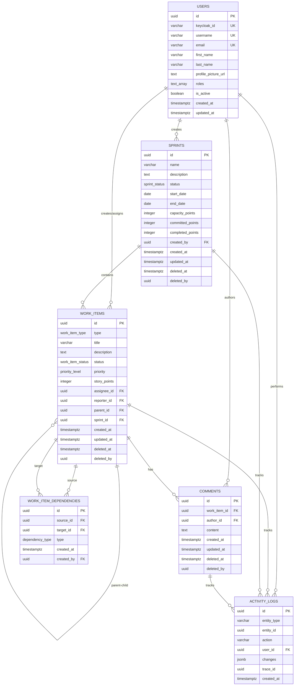

# Database Entity Relationship Diagram (ERD)

This diagram shows the complete database schema for the Sprint Management System.

## Complete ERD



## Schema Organization

### auth Schema
- **users**: User accounts and profiles

### sprint_management Schema
- **work_items**: Epics, stories, and defects
- **sprints**: Time-boxed iterations
- **work_item_dependencies**: Relationships between work items
- **comments**: Discussion threads on work items
- **activity_logs**: Audit trail for all changes

## Custom Types

### Enums

```sql
-- Work item types
CREATE TYPE work_item_type AS ENUM ('epic', 'story', 'defect');

-- Work item statuses
CREATE TYPE work_item_status AS ENUM ('todo', 'in_progress', 'in_review', 'done', 'blocked');

-- Priority levels
CREATE TYPE priority_level AS ENUM ('low', 'medium', 'high', 'critical');

-- Sprint statuses
CREATE TYPE sprint_status AS ENUM ('planned', 'active', 'completed', 'cancelled');

-- Dependency types
CREATE TYPE dependency_type AS ENUM ('blocks', 'is_blocked_by', 'relates_to', 'duplicates');
```

## Key Relationships

### One-to-Many Relationships

1. **Users → Work Items (Reporter)**
   - One user can report many work items
   - Every work item must have a reporter

2. **Users → Work Items (Assignee)**
   - One user can be assigned to many work items
   - Work items can be unassigned (optional)

3. **Sprints → Work Items**
   - One sprint can contain many work items
   - Work items can be in backlog (no sprint)

4. **Work Items → Work Items (Parent-Child)**
   - Epics can have multiple child stories
   - Stories can have multiple child defects
   - Self-referential relationship

5. **Work Items → Comments**
   - One work item can have many comments
   - Every comment belongs to one work item

6. **Users → Comments**
   - One user can author many comments
   - Every comment has one author

### Many-to-Many Relationships

1. **Work Items ↔ Work Items (Dependencies)**
   - Implemented via work_item_dependencies junction table
   - Supports multiple dependency types
   - Prevents self-dependencies via constraint

## Indexes

### Performance Indexes

```sql
-- Work items
CREATE INDEX idx_work_items_type ON work_items(type);
CREATE INDEX idx_work_items_status ON work_items(status);
CREATE INDEX idx_work_items_assignee ON work_items(assignee_id);
CREATE INDEX idx_work_items_sprint ON work_items(sprint_id);
CREATE INDEX idx_work_items_parent ON work_items(parent_id);
CREATE INDEX idx_work_items_deleted ON work_items(deleted_at) WHERE deleted_at IS NULL;

-- Sprints
CREATE INDEX idx_sprints_status ON sprints(status);
CREATE INDEX idx_sprints_dates ON sprints(start_date, end_date);
CREATE INDEX idx_sprints_deleted ON sprints(deleted_at) WHERE deleted_at IS NULL;

-- Comments
CREATE INDEX idx_comments_work_item ON comments(work_item_id);
CREATE INDEX idx_comments_author ON comments(author_id);
CREATE INDEX idx_comments_deleted ON comments(deleted_at) WHERE deleted_at IS NULL;

-- Activity logs
CREATE INDEX idx_activity_entity ON activity_logs(entity_type, entity_id);
CREATE INDEX idx_activity_user ON activity_logs(user_id);
CREATE INDEX idx_activity_trace ON activity_logs(trace_id);
CREATE INDEX idx_activity_created ON activity_logs(created_at);

-- Users
CREATE INDEX idx_users_keycloak ON users(keycloak_id);
CREATE INDEX idx_users_username ON users(username);
CREATE INDEX idx_users_email ON users(email);
```

### Full-Text Search Indexes

```sql
-- Work items search
CREATE INDEX idx_work_items_search ON work_items 
USING gin(to_tsvector('english', title || ' ' || COALESCE(description, '')));
```

### Cursor Pagination Indexes

```sql
-- Work items pagination
CREATE INDEX idx_work_items_cursor ON work_items(created_at, id);

-- Sprints pagination
CREATE INDEX idx_sprints_cursor ON sprints(created_at, id);
```

## Constraints

### Foreign Key Constraints

```sql
-- Work items
ALTER TABLE work_items
  ADD CONSTRAINT fk_work_items_assignee FOREIGN KEY (assignee_id) REFERENCES users(id),
  ADD CONSTRAINT fk_work_items_reporter FOREIGN KEY (reporter_id) REFERENCES users(id),
  ADD CONSTRAINT fk_work_items_parent FOREIGN KEY (parent_id) REFERENCES work_items(id),
  ADD CONSTRAINT fk_work_items_sprint FOREIGN KEY (sprint_id) REFERENCES sprints(id);

-- Sprints
ALTER TABLE sprints
  ADD CONSTRAINT fk_sprints_created_by FOREIGN KEY (created_by) REFERENCES users(id);

-- Dependencies
ALTER TABLE work_item_dependencies
  ADD CONSTRAINT fk_dependencies_source FOREIGN KEY (source_id) REFERENCES work_items(id),
  ADD CONSTRAINT fk_dependencies_target FOREIGN KEY (target_id) REFERENCES work_items(id);

-- Comments
ALTER TABLE comments
  ADD CONSTRAINT fk_comments_work_item FOREIGN KEY (work_item_id) REFERENCES work_items(id),
  ADD CONSTRAINT fk_comments_author FOREIGN KEY (author_id) REFERENCES users(id);

-- Activity logs
ALTER TABLE activity_logs
  ADD CONSTRAINT fk_activity_user FOREIGN KEY (user_id) REFERENCES users(id);
```

### Check Constraints

```sql
-- Sprint date validation
ALTER TABLE sprints
  ADD CONSTRAINT valid_date_range CHECK (end_date > start_date);

-- No self-dependencies
ALTER TABLE work_item_dependencies
  ADD CONSTRAINT no_self_dependency CHECK (source_id != target_id);
```

### Unique Constraints

```sql
-- Users
ALTER TABLE users
  ADD CONSTRAINT uk_users_keycloak_id UNIQUE (keycloak_id),
  ADD CONSTRAINT uk_users_username UNIQUE (username),
  ADD CONSTRAINT uk_users_email UNIQUE (email);

-- Dependencies (prevent duplicate relationships)
ALTER TABLE work_item_dependencies
  ADD CONSTRAINT uk_dependencies UNIQUE (source_id, target_id, type);
```

## Soft Delete Pattern

All major entities support soft delete:

```sql
-- Soft delete columns
deleted_at TIMESTAMPTZ    -- When deleted (NULL if not deleted)
deleted_by UUID           -- Who deleted it
```

Queries automatically filter soft-deleted records:

```sql
-- Normal queries exclude deleted items
SELECT * FROM work_items WHERE deleted_at IS NULL;

-- Recovery queries include deleted items
SELECT * FROM work_items WHERE deleted_at IS NOT NULL;
```

## Audit Trail

The `activity_logs` table provides comprehensive audit tracking:

```sql
-- Example activity log entry
{
  "entity_type": "work_item",
  "entity_id": "123e4567-e89b-12d3-a456-426614174000",
  "action": "status_changed",
  "user_id": "user-uuid",
  "changes": {
    "before": {"status": "in_progress"},
    "after": {"status": "done"}
  },
  "trace_id": "trace-uuid",
  "created_at": "2024-01-15T10:30:00Z"
}
```

## Data Integrity

### Referential Integrity

- All foreign keys enforce referential integrity
- Cascade deletes are NOT used (soft delete pattern)
- Orphaned records are prevented by constraints

### Data Validation

- Enum types enforce valid values
- Check constraints enforce business rules
- NOT NULL constraints enforce required fields
- Unique constraints prevent duplicates

## Migration Strategy

Database schema is managed using golang-migrate:

```bash
# Apply migrations
migrate -path migrations -database $DATABASE_URL up

# Rollback migrations
migrate -path migrations -database $DATABASE_URL down 1

# Check version
migrate -path migrations -database $DATABASE_URL version
```

See [Database Setup Guide](../database-setup.md) for detailed migration procedures.
