# Deployment Diagram: Kubernetes Architecture

This diagram shows the Kubernetes deployment architecture for the Sprint Management System.

## Kubernetes Deployment Architecture

```mermaid
graph TB
    subgraph "External"
        USERS[Users/Clients]
        ADMIN[Administrators]
    end

    subgraph "Ingress Layer"
        LB[Load Balancer<br/>External IP]
        INGRESS[Nginx Ingress Controller<br/>TLS Termination]
    end

    subgraph "Kubernetes Cluster"
        subgraph "sprint-management Namespace"
            subgraph "Application Pods"
                SPRINT1[Sprint Service Pod 1<br/>sprint-management:v1.2.3]
                SPRINT2[Sprint Service Pod 2<br/>sprint-management:v1.2.3]
                SPRINT3[Sprint Service Pod 3<br/>sprint-management:v1.2.3]
                
                AUTH1[Auth Service Pod 1<br/>auth-service:v1.0.5]
                AUTH2[Auth Service Pod 2<br/>auth-service:v1.0.5]
            end

            subgraph "Services"
                SPRINT_SVC[Sprint Service<br/>ClusterIP: 8080]
                AUTH_SVC[Auth Service<br/>ClusterIP: 8081]
                NATS_SVC[NATS Service<br/>ClusterIP: 4222, 8222]
                DB_MASTER_SVC[PostgreSQL Master<br/>ClusterIP: 5432]
                DB_REPLICA_SVC[PostgreSQL Replica<br/>ClusterIP: 5433]
                KC_SVC[Keycloak Service<br/>ClusterIP: 8080]
            end

            subgraph "StatefulSets"
                NATS_SS[NATS StatefulSet<br/>3 replicas]
                DB_MASTER_SS[PostgreSQL Master<br/>1 replica]
                DB_REPLICA_SS[PostgreSQL Replica<br/>2 replicas]
                KC_SS[Keycloak StatefulSet<br/>2 replicas]
            end

            subgraph "Storage"
                PVC_NATS[PVC: nats-data<br/>10Gi SSD]
                PVC_DB_MASTER[PVC: postgres-master<br/>100Gi SSD]
                PVC_DB_REPLICA[PVC: postgres-replica<br/>100Gi SSD]
                PVC_KC[PVC: keycloak-data<br/>10Gi SSD]
            end

            subgraph "Configuration"
                CM_SPRINT[ConfigMap<br/>sprint-config]
                CM_AUTH[ConfigMap<br/>auth-config]
                SECRET[Secret<br/>database-credentials]
            end

            subgraph "Autoscaling"
                HPA_SPRINT[HorizontalPodAutoscaler<br/>Min: 3, Max: 10<br/>CPU: 70%]
                HPA_AUTH[HorizontalPodAutoscaler<br/>Min: 2, Max: 5<br/>CPU: 70%]
            end
        end

        subgraph "monitoring Namespace"
            PROM[Prometheus<br/>Metrics Collection]
            GRAF[Grafana<br/>Visualization]
            ALERT[Alertmanager<br/>Alert Routing]
        end

        subgraph "kube-system Namespace"
            DNS[CoreDNS<br/>Service Discovery]
            METRICS[Metrics Server<br/>Resource Metrics]
        end
    end

    %% External connections
    USERS -->|HTTPS| LB
    ADMIN -->|HTTPS| LB
    LB --> INGRESS

    %% Ingress routing
    INGRESS -->|/api/v1/*| SPRINT_SVC
    INGRESS -->|/ws| SPRINT_SVC
    INGRESS -->|/auth/*| AUTH_SVC

    %% Service to Pod connections
    SPRINT_SVC --> SPRINT1
    SPRINT_SVC --> SPRINT2
    SPRINT_SVC --> SPRINT3
    AUTH_SVC --> AUTH1
    AUTH_SVC --> AUTH2

    %% Pod to Service connections
    SPRINT1 --> NATS_SVC
    SPRINT2 --> NATS_SVC
    SPRINT3 --> NATS_SVC
    SPRINT1 --> DB_MASTER_SVC
    SPRINT2 --> DB_MASTER_SVC
    SPRINT3 --> DB_MASTER_SVC
    SPRINT1 --> DB_REPLICA_SVC
    SPRINT2 --> DB_REPLICA_SVC
    SPRINT3 --> DB_REPLICA_SVC

    AUTH1 --> NATS_SVC
    AUTH2 --> NATS_SVC
    AUTH1 --> KC_SVC
    AUTH2 --> KC_SVC
    AUTH1 --> DB_MASTER_SVC
    AUTH2 --> DB_MASTER_SVC

    %% Service to StatefulSet
    NATS_SVC --> NATS_SS
    DB_MASTER_SVC --> DB_MASTER_SS
    DB_REPLICA_SVC --> DB_REPLICA_SS
    KC_SVC --> KC_SS

    %% StatefulSet to Storage
    NATS_SS --> PVC_NATS
    DB_MASTER_SS --> PVC_DB_MASTER
    DB_REPLICA_SS --> PVC_DB_REPLICA
    KC_SS --> PVC_KC

    %% Configuration
    SPRINT1 -.->|Reads| CM_SPRINT
    SPRINT2 -.->|Reads| CM_SPRINT
    SPRINT3 -.->|Reads| CM_SPRINT
    SPRINT1 -.->|Reads| SECRET
    SPRINT2 -.->|Reads| SECRET
    SPRINT3 -.->|Reads| SECRET

    AUTH1 -.->|Reads| CM_AUTH
    AUTH2 -.->|Reads| CM_AUTH
    AUTH1 -.->|Reads| SECRET
    AUTH2 -.->|Reads| SECRET

    %% Autoscaling
    HPA_SPRINT -.->|Scales| SPRINT_SVC
    HPA_AUTH -.->|Scales| AUTH_SVC

    %% Monitoring
    PROM -->|Scrapes| SPRINT1
    PROM -->|Scrapes| SPRINT2
    PROM -->|Scrapes| SPRINT3
    PROM -->|Scrapes| AUTH1
    PROM -->|Scrapes| AUTH2
    GRAF -->|Queries| PROM
    ALERT -->|Receives| PROM

    %% Service Discovery
    SPRINT1 -.->|DNS Lookup| DNS
    AUTH1 -.->|DNS Lookup| DNS

    %% Metrics
    METRICS -->|Collects| SPRINT1
    METRICS -->|Collects| AUTH1
    HPA_SPRINT -->|Queries| METRICS
    HPA_AUTH -->|Queries| METRICS

    %% Styling
    classDef externalClass fill:#90EE90,stroke:#333,stroke-width:2px
    classDef ingressClass fill:#FFD700,stroke:#333,stroke-width:2px
    classDef appClass fill:#4A90E2,stroke:#333,stroke-width:2px
    classDef serviceClass fill:#9370DB,stroke:#333,stroke-width:2px
    classDef storageClass fill:#FF6B6B,stroke:#333,stroke-width:2px
    classDef configClass fill:#FFA500,stroke:#333,stroke-width:2px
    classDef monitorClass fill:#20B2AA,stroke:#333,stroke-width:2px

    class USERS,ADMIN externalClass
    class LB,INGRESS ingressClass
    class SPRINT1,SPRINT2,SPRINT3,AUTH1,AUTH2 appClass
    class SPRINT_SVC,AUTH_SVC,NATS_SVC,DB_MASTER_SVC,DB_REPLICA_SVC,KC_SVC serviceClass
    class NATS_SS,DB_MASTER_SS,DB_REPLICA_SS,KC_SS serviceClass
    class PVC_NATS,PVC_DB_MASTER,PVC_DB_REPLICA,PVC_KC storageClass
    class CM_SPRINT,CM_AUTH,SECRET,HPA_SPRINT,HPA_AUTH configClass
    class PROM,GRAF,ALERT,DNS,METRICS monitorClass
```



## Deployment Components

### Namespace: sprint-management

All application components are deployed in the `sprint-management` namespace for isolation and resource management.

### Application Deployments

#### Sprint Management Service

```yaml
apiVersion: apps/v1
kind: Deployment
metadata:
  name: sprint-management
  namespace: sprint-management
spec:
  replicas: 3
  selector:
    matchLabels:
      app: sprint-management
  template:
    metadata:
      labels:
        app: sprint-management
        version: v1.2.3
    spec:
      containers:
      - name: sprint-management
        image: sprint-management:v1.2.3
        ports:
        - containerPort: 8080
          name: http
        - containerPort: 8081
          name: metrics
        env:
        - name: DATABASE_MASTER_URL
          valueFrom:
            secretKeyRef:
              name: database-credentials
              key: master-url
        - name: DATABASE_REPLICA_URL
          valueFrom:
            secretKeyRef:
              name: database-credentials
              key: replica-url
        - name: NATS_URL
          value: "nats://nats:4222"
        resources:
          requests:
            memory: "512Mi"
            cpu: "500m"
          limits:
            memory: "2Gi"
            cpu: "2000m"
        livenessProbe:
          httpGet:
            path: /health/live
            port: 8080
          initialDelaySeconds: 30
          periodSeconds: 10
        readinessProbe:
          httpGet:
            path: /health/ready
            port: 8080
          initialDelaySeconds: 5
          periodSeconds: 5
```

#### Auth Service

```yaml
apiVersion: apps/v1
kind: Deployment
metadata:
  name: auth-service
  namespace: sprint-management
spec:
  replicas: 2
  selector:
    matchLabels:
      app: auth-service
  template:
    metadata:
      labels:
        app: auth-service
        version: v1.0.5
    spec:
      containers:
      - name: auth-service
        image: auth-service:v1.0.5
        ports:
        - containerPort: 8080
          name: http
        - containerPort: 8081
          name: metrics
        env:
        - name: DATABASE_URL
          valueFrom:
            secretKeyRef:
              name: database-credentials
              key: auth-url
        - name: KEYCLOAK_URL
          value: "http://keycloak:8080"
        - name: NATS_URL
          value: "nats://nats:4222"
        resources:
          requests:
            memory: "256Mi"
            cpu: "250m"
          limits:
            memory: "1Gi"
            cpu: "1000m"
```

### StatefulSets

#### NATS Cluster

```yaml
apiVersion: apps/v1
kind: StatefulSet
metadata:
  name: nats
  namespace: sprint-management
spec:
  serviceName: nats
  replicas: 3
  selector:
    matchLabels:
      app: nats
  template:
    metadata:
      labels:
        app: nats
    spec:
      containers:
      - name: nats
        image: nats:2.12
        ports:
        - containerPort: 4222
          name: client
        - containerPort: 8222
          name: monitoring
        - containerPort: 6222
          name: cluster
        volumeMounts:
        - name: nats-data
          mountPath: /data
        resources:
          requests:
            memory: "256Mi"
            cpu: "250m"
          limits:
            memory: "1Gi"
            cpu: "1000m"
  volumeClaimTemplates:
  - metadata:
      name: nats-data
    spec:
      accessModes: ["ReadWriteOnce"]
      storageClassName: fast-ssd
      resources:
        requests:
          storage: 10Gi
```

#### PostgreSQL Master

```yaml
apiVersion: apps/v1
kind: StatefulSet
metadata:
  name: postgres-master
  namespace: sprint-management
spec:
  serviceName: postgres-master
  replicas: 1
  selector:
    matchLabels:
      app: postgres
      role: master
  template:
    metadata:
      labels:
        app: postgres
        role: master
    spec:
      containers:
      - name: postgres
        image: postgres:18
        ports:
        - containerPort: 5432
          name: postgres
        env:
        - name: POSTGRES_DB
          value: sprint_management
        - name: POSTGRES_USER
          valueFrom:
            secretKeyRef:
              name: database-credentials
              key: username
        - name: POSTGRES_PASSWORD
          valueFrom:
            secretKeyRef:
              name: database-credentials
              key: password
        volumeMounts:
        - name: postgres-data
          mountPath: /var/lib/postgresql/data
        resources:
          requests:
            memory: "2Gi"
            cpu: "1000m"
          limits:
            memory: "8Gi"
            cpu: "4000m"
  volumeClaimTemplates:
  - metadata:
      name: postgres-data
    spec:
      accessModes: ["ReadWriteOnce"]
      storageClassName: fast-ssd
      resources:
        requests:
          storage: 100Gi
```

### Services

#### Sprint Management Service

```yaml
apiVersion: v1
kind: Service
metadata:
  name: sprint-management
  namespace: sprint-management
spec:
  type: ClusterIP
  selector:
    app: sprint-management
  ports:
  - name: http
    port: 8080
    targetPort: 8080
  - name: metrics
    port: 8081
    targetPort: 8081
```

#### NATS Service

```yaml
apiVersion: v1
kind: Service
metadata:
  name: nats
  namespace: sprint-management
spec:
  type: ClusterIP
  clusterIP: None  # Headless service for StatefulSet
  selector:
    app: nats
  ports:
  - name: client
    port: 4222
    targetPort: 4222
  - name: monitoring
    port: 8222
    targetPort: 8222
  - name: cluster
    port: 6222
    targetPort: 6222
```

### Ingress

```yaml
apiVersion: networking.k8s.io/v1
kind: Ingress
metadata:
  name: sprint-management
  namespace: sprint-management
  annotations:
    nginx.ingress.kubernetes.io/ssl-redirect: "true"
    nginx.ingress.kubernetes.io/websocket-services: sprint-management
    cert-manager.io/cluster-issuer: letsencrypt-prod
spec:
  ingressClassName: nginx
  tls:
  - hosts:
    - sprint.yourdomain.com
    secretName: sprint-tls
  rules:
  - host: sprint.yourdomain.com
    http:
      paths:
      - path: /api/v1
        pathType: Prefix
        backend:
          service:
            name: sprint-management
            port:
              number: 8080
      - path: /ws
        pathType: Prefix
        backend:
          service:
            name: sprint-management
            port:
              number: 8080
      - path: /auth
        pathType: Prefix
        backend:
          service:
            name: auth-service
            port:
              number: 8080
```

### ConfigMaps

```yaml
apiVersion: v1
kind: ConfigMap
metadata:
  name: sprint-config
  namespace: sprint-management
data:
  config.yaml: |
    server:
      port: 8080
      read_timeout: 30s
      write_timeout: 30s
    
    logging:
      level: info
      format: json
    
    metrics:
      enabled: true
      port: 8081
    
    rate_limiting:
      enabled: true
      requests_per_minute: 100
```

### Secrets

```yaml
apiVersion: v1
kind: Secret
metadata:
  name: database-credentials
  namespace: sprint-management
type: Opaque
stringData:
  username: postgres
  password: <base64-encoded-password>
  master-url: postgres://postgres:<password>@postgres-master:5432/sprint_management
  replica-url: postgres://postgres:<password>@postgres-replica:5432/sprint_management
  auth-url: postgres://postgres:<password>@postgres-master:5432/auth
```

### Horizontal Pod Autoscaler

```yaml
apiVersion: autoscaling/v2
kind: HorizontalPodAutoscaler
metadata:
  name: sprint-management-hpa
  namespace: sprint-management
spec:
  scaleTargetRef:
    apiVersion: apps/v1
    kind: Deployment
    name: sprint-management
  minReplicas: 3
  maxReplicas: 10
  metrics:
  - type: Resource
    resource:
      name: cpu
      target:
        type: Utilization
        averageUtilization: 70
  - type: Resource
    resource:
      name: memory
      target:
        type: Utilization
        averageUtilization: 80
  behavior:
    scaleDown:
      stabilizationWindowSeconds: 300
      policies:
      - type: Percent
        value: 50
        periodSeconds: 60
    scaleUp:
      stabilizationWindowSeconds: 0
      policies:
      - type: Percent
        value: 100
        periodSeconds: 30
      - type: Pods
        value: 2
        periodSeconds: 30
      selectPolicy: Max
```

## Deployment Procedures

### Initial Deployment

```bash
# 1. Create namespace
kubectl apply -f k8s/namespace.yaml

# 2. Create secrets
kubectl apply -f k8s/secrets.yaml

# 3. Create configmaps
kubectl apply -f k8s/configmap.yaml

# 4. Deploy PostgreSQL
kubectl apply -f k8s/postgres-deployment.yaml

# 5. Wait for PostgreSQL to be ready
kubectl wait --for=condition=ready pod -l app=postgres -n sprint-management --timeout=300s

# 6. Run database migrations
kubectl exec -it deployment/sprint-management -n sprint-management -- ./main migrate up

# 7. Deploy NATS
kubectl apply -f k8s/nats-deployment.yaml

# 8. Deploy Keycloak
kubectl apply -f k8s/keycloak-deployment.yaml

# 9. Deploy Auth Service
kubectl apply -f k8s/auth-service-deployment.yaml

# 10. Deploy Sprint Service
kubectl apply -f k8s/sprint-service-deployment.yaml

# 11. Create ingress
kubectl apply -f k8s/ingress.yaml

# 12. Verify deployment
kubectl get pods -n sprint-management
kubectl get services -n sprint-management
kubectl get ingress -n sprint-management
```

### Rolling Update

```bash
# Update image
kubectl set image deployment/sprint-management \
  sprint-management=sprint-management:v1.2.4 \
  -n sprint-management

# Monitor rollout
kubectl rollout status deployment/sprint-management -n sprint-management

# Verify new version
kubectl get pods -n sprint-management -o jsonpath='{.items[*].spec.containers[*].image}'
```

### Rollback

```bash
# View rollout history
kubectl rollout history deployment/sprint-management -n sprint-management

# Rollback to previous version
kubectl rollout undo deployment/sprint-management -n sprint-management

# Rollback to specific revision
kubectl rollout undo deployment/sprint-management --to-revision=2 -n sprint-management
```

## High Availability

### Pod Distribution

- **Anti-affinity rules**: Spread pods across nodes
- **Pod disruption budgets**: Ensure minimum availability during updates
- **Multiple replicas**: 3+ replicas for critical services

### Database Replication

- **Master-replica setup**: Write to master, read from replicas
- **Automatic failover**: Using Patroni or similar
- **Backup strategy**: Automated daily backups

### NATS Clustering

- **3-node cluster**: Quorum-based consensus
- **Automatic leader election**: Built-in NATS feature
- **Message persistence**: JetStream for durability

## Monitoring and Observability

### Prometheus Metrics

```yaml
apiVersion: v1
kind: ServiceMonitor
metadata:
  name: sprint-management
  namespace: sprint-management
spec:
  selector:
    matchLabels:
      app: sprint-management
  endpoints:
  - port: metrics
    interval: 30s
    path: /metrics
```

### Grafana Dashboards

- Service overview dashboard
- Database performance dashboard
- NATS messaging dashboard
- Business metrics dashboard

### Logging

- **Log aggregation**: Fluentd/Fluent Bit → Elasticsearch
- **Log format**: Structured JSON
- **Trace correlation**: Trace IDs in all logs

## Security

### Network Policies

```yaml
apiVersion: networking.k8s.io/v1
kind: NetworkPolicy
metadata:
  name: sprint-management-policy
  namespace: sprint-management
spec:
  podSelector:
    matchLabels:
      app: sprint-management
  policyTypes:
  - Ingress
  - Egress
  ingress:
  - from:
    - namespaceSelector:
        matchLabels:
          name: ingress-nginx
    ports:
    - protocol: TCP
      port: 8080
  egress:
  - to:
    - podSelector:
        matchLabels:
          app: postgres
    ports:
    - protocol: TCP
      port: 5432
  - to:
    - podSelector:
        matchLabels:
          app: nats
    ports:
    - protocol: TCP
      port: 4222
```

### RBAC

```yaml
apiVersion: rbac.authorization.k8s.io/v1
kind: Role
metadata:
  name: sprint-management-role
  namespace: sprint-management
rules:
- apiGroups: [""]
  resources: ["configmaps", "secrets"]
  verbs: ["get", "list"]
- apiGroups: [""]
  resources: ["pods"]
  verbs: ["get", "list"]
```

## Resource Quotas

```yaml
apiVersion: v1
kind: ResourceQuota
metadata:
  name: sprint-management-quota
  namespace: sprint-management
spec:
  hard:
    requests.cpu: "20"
    requests.memory: 40Gi
    limits.cpu: "40"
    limits.memory: 80Gi
    persistentvolumeclaims: "10"
```

## Related Documentation

- [Kubernetes Deployment Guide](../kubernetes-deployment.md)
- [Operational Runbook](../operational-runbook.md)
- [Troubleshooting Guide](../troubleshooting-guide.md)
- [Container Diagram](c4-container.md)
