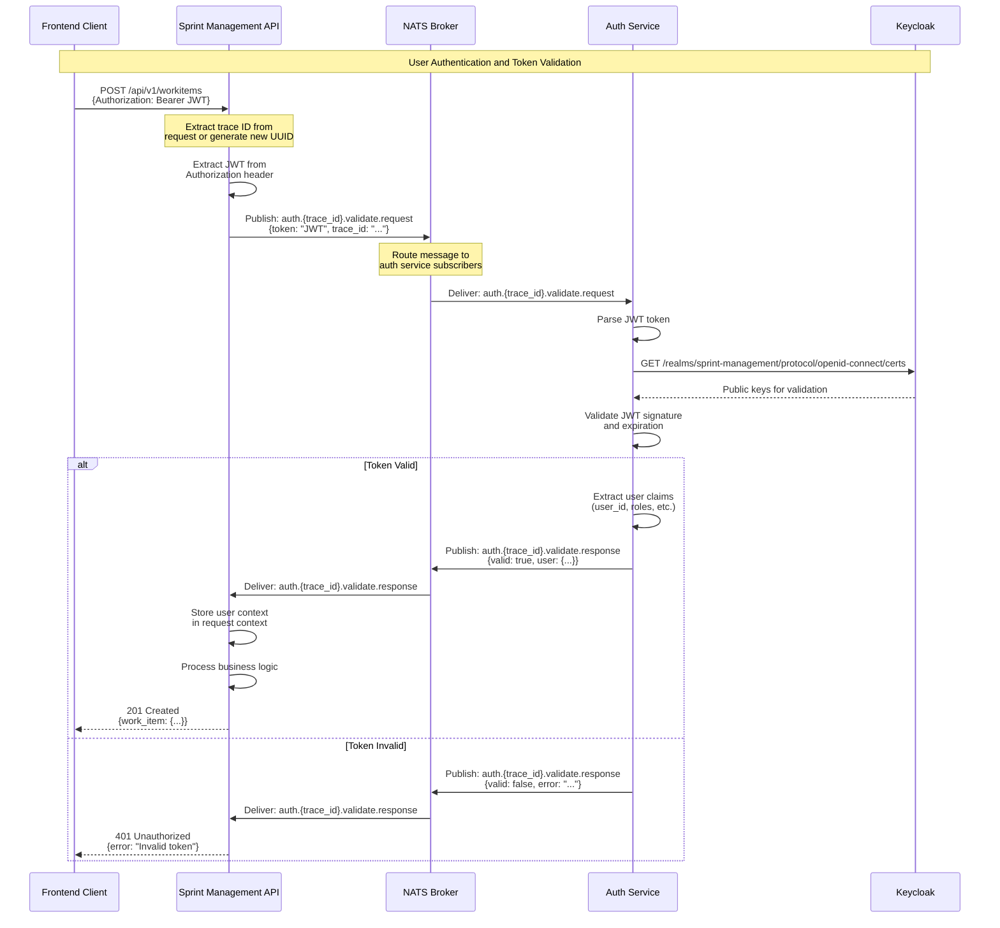
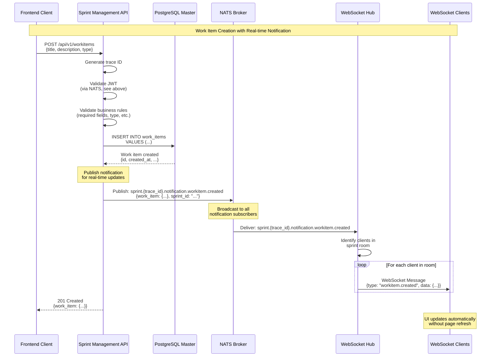
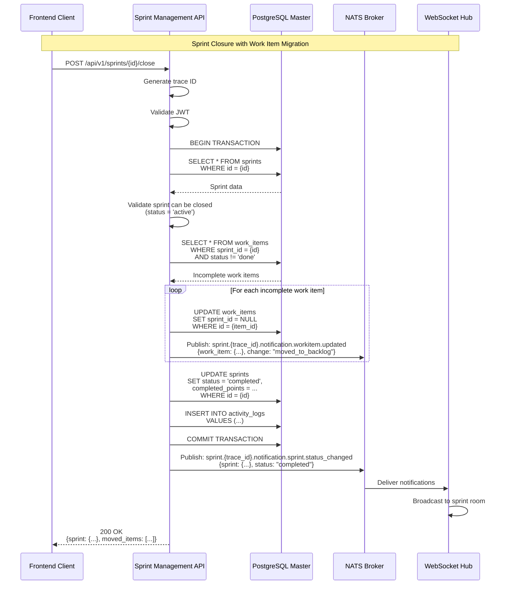
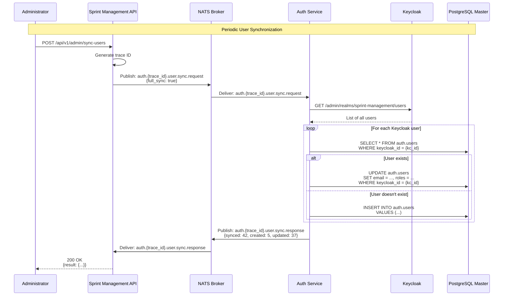
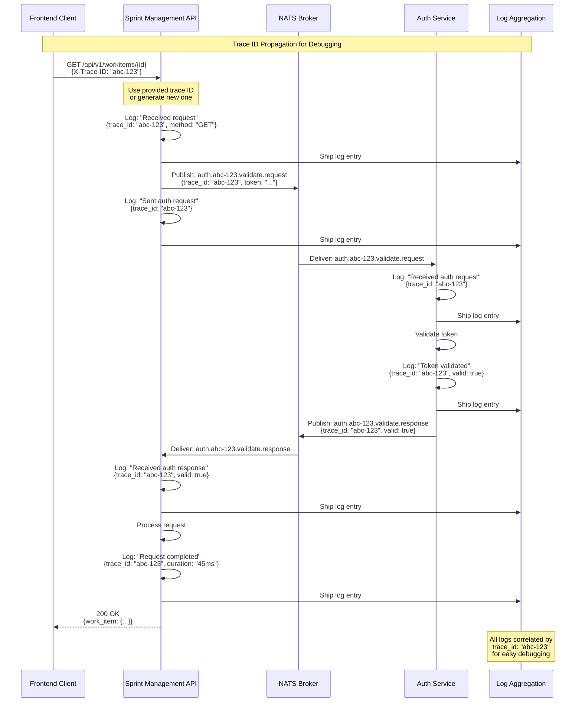

# Sequence Diagram: NATS Messaging Flows

This diagram shows the detailed message flows using NATS for inter-service communication.

## JWT Token Validation Flow



## Work Item Creation with Notification



## Sprint Closure Workflow



## User Synchronization from Keycloak



## Distributed Tracing Across Services



## NATS Subject Patterns

### Sprint Management Service

#### Work Item Operations
```
sprint.{trace_id}.workitem.create.request
sprint.{trace_id}.workitem.create.response
sprint.{trace_id}.workitem.update.request
sprint.{trace_id}.workitem.update.response
sprint.{trace_id}.workitem.delete.request
sprint.{trace_id}.workitem.delete.response
```

#### Sprint Operations
```
sprint.{trace_id}.sprint.create.request
sprint.{trace_id}.sprint.create.response
sprint.{trace_id}.sprint.close.request
sprint.{trace_id}.sprint.close.response
```

#### Real-time Notifications
```
sprint.{trace_id}.notification.workitem.created
sprint.{trace_id}.notification.workitem.updated
sprint.{trace_id}.notification.workitem.deleted
sprint.{trace_id}.notification.sprint.status_changed
sprint.{trace_id}.notification.comment.added
```

### Authentication Service

#### Token Validation
```
auth.{trace_id}.validate.request
auth.{trace_id}.validate.response
```

#### User Management
```
auth.{trace_id}.user.sync.request
auth.{trace_id}.user.sync.response
auth.{trace_id}.user.create.request
auth.{trace_id}.user.create.response
```

### Wildcard Subscriptions

#### Service-specific Tracing
```
sprint.{trace_id}.*.*.*    # All sprint service messages for trace
auth.{trace_id}.*.*        # All auth service messages for trace
```

#### Notification Monitoring
```
sprint.*.notification.*    # All notifications from sprint service
*.*.notification.*         # All notifications from any service
```

#### Debug Subscriptions
```
sprint.>                   # All sprint service messages
auth.>                     # All auth service messages
>                          # All messages (use with caution)
```

## Message Format

### Request Message
```json
{
  "trace_id": "abc-123-def-456",
  "timestamp": "2024-01-15T10:30:00Z",
  "correlation_id": "req-789",
  "payload": {
    "token": "eyJhbGciOiJSUzI1NiIs...",
    "user_id": "user-uuid"
  }
}
```

### Response Message
```json
{
  "trace_id": "abc-123-def-456",
  "timestamp": "2024-01-15T10:30:00.123Z",
  "correlation_id": "req-789",
  "success": true,
  "payload": {
    "valid": true,
    "user": {
      "id": "user-uuid",
      "username": "john.doe",
      "roles": ["developer"]
    }
  },
  "error": null
}
```

### Notification Message
```json
{
  "trace_id": "abc-123-def-456",
  "timestamp": "2024-01-15T10:30:00.456Z",
  "type": "workitem.created",
  "entity_type": "work_item",
  "entity_id": "work-item-uuid",
  "sprint_id": "sprint-uuid",
  "user_id": "user-uuid",
  "payload": {
    "work_item": {
      "id": "work-item-uuid",
      "title": "New Feature",
      "type": "story",
      "status": "todo"
    }
  }
}
```

## Error Handling

### Timeout Handling
```
1. Sprint API publishes request
2. Sprint API waits for response (5 second timeout)
3. If timeout:
   - Log error with trace ID
   - Return 503 Service Unavailable to client
   - Retry with exponential backoff (optional)
```

### Connection Failure
```
1. NATS connection lost
2. Service attempts reconnection
3. Buffered messages queued
4. On reconnection:
   - Resubscribe to subjects
   - Flush queued messages
   - Resume normal operation
```

### Invalid Message Format
```
1. Service receives malformed message
2. Log error with trace ID and message content
3. Send error response (if request/response pattern)
4. Continue processing other messages
```

## Performance Considerations

### Message Size
- Keep messages small (< 1MB)
- Use references instead of embedding large objects
- Compress large payloads if necessary

### Throughput
- NATS can handle millions of messages per second
- Bottleneck typically in message processing, not NATS
- Scale services horizontally for higher throughput

### Latency
- Typical NATS latency: < 1ms
- End-to-end latency depends on processing time
- Use async patterns for non-critical operations

## Monitoring

### NATS Metrics
```bash
# View NATS monitoring endpoint
curl http://nats-server:8222/varz

# Key metrics:
# - connections: Active connections
# - in_msgs: Messages received
# - out_msgs: Messages sent
# - slow_consumers: Slow consumer count
```

### Application Metrics
```prometheus
# Message publish rate
rate(nats_messages_published_total[5m])

# Message receive rate
rate(nats_messages_received_total[5m])

# Message processing duration
histogram_quantile(0.95, rate(nats_message_duration_seconds_bucket[5m]))
```

## Related Documentation

- [NATS Subject Patterns](../nats.md): Complete subject documentation
- [Auth Service NATS](../../go_auth/docs/nats.md): Auth service subjects
- [Container Diagram](c4-container.md): System architecture
- [Troubleshooting Guide](../troubleshooting-guide.md): NATS troubleshooting
