# User Flow: Sprint Planning

This diagram shows the complete workflow for planning and executing a sprint.

## Sprint Planning Flow

```mermaid
flowchart TD
    Start([Sprint Planning Begins]) --> Login[User Logs In]
    
    Login --> Auth{Authentication<br/>Successful?}
    Auth -->|No| Login
    Auth -->|Yes| Dashboard[View Dashboard]
    
    Dashboard --> CreateSprint[Create New Sprint]
    
    CreateSprint --> SprintDetails[Enter Sprint Details]
    SprintDetails --> SprintName[Sprint Name]
    SprintDetails --> SprintDates[Start/End Dates]
    SprintDetails --> SprintCapacity[Team Capacity<br/>Story Points]
    
    SprintName --> ValidateSprint{Validate<br/>Sprint Data}
    SprintDates --> ValidateSprint
    SprintCapacity --> ValidateSprint
    
    ValidateSprint -->|Invalid| SprintDetails
    ValidateSprint -->|Valid| SaveSprint[Save Sprint]
    
    SaveSprint --> ViewBacklog[View Product Backlog]
    
    ViewBacklog --> FilterBacklog{Filter/Search<br/>Work Items?}
    FilterBacklog -->|Yes| ApplyFilters[Apply Filters]
    ApplyFilters --> ViewBacklog
    FilterBacklog -->|No| SelectItems[Select Work Items<br/>for Sprint]
    
    SelectItems --> CheckCapacity{Within Sprint<br/>Capacity?}
    CheckCapacity -->|No| CapacityWarning[Show Capacity Warning]
    CapacityWarning --> AdjustSelection{Adjust<br/>Selection?}
    AdjustSelection -->|Yes| SelectItems
    AdjustSelection -->|No| OverrideCapacity[Override Capacity]
    OverrideCapacity --> AddToSprint
    
    CheckCapacity -->|Yes| AddToSprint[Add Items to Sprint]
    
    AddToSprint --> SetPriorities[Set Item Priorities]
    SetPriorities --> AssignWork[Assign Work Items<br/>to Team Members]
    
    AssignWork --> ReviewSprint[Review Sprint Plan]
    
    ReviewSprint --> SprintReady{Sprint Plan<br/>Complete?}
    SprintReady -->|No| AdjustPlan{What to Adjust?}
    AdjustPlan -->|Items| SelectItems
    AdjustPlan -->|Assignments| AssignWork
    AdjustPlan -->|Priorities| SetPriorities
    
    SprintReady -->|Yes| ActivateSprint[Activate Sprint]
    
    ActivateSprint --> NotifyTeam[Notify Team Members]
    NotifyTeam --> SprintActive[Sprint Active]
    
    SprintActive --> DailyWork[Daily Development Work]
    
    DailyWork --> UpdateStatus[Update Work Item Status]
    UpdateStatus --> LogTime[Log Time Spent]
    LogTime --> AddComments[Add Comments/Notes]
    
    AddComments --> CheckProgress{Check Sprint<br/>Progress}
    CheckProgress --> ViewBurndown[View Burndown Chart]
    ViewBurndown --> OnTrack{Sprint<br/>On Track?}
    
    OnTrack -->|Yes| ContinueWork[Continue Work]
    ContinueWork --> DailyWork
    
    OnTrack -->|No| Blockers{Identify<br/>Blockers}
    Blockers --> ResolveBlockers[Resolve Blockers]
    ResolveBlockers --> AdjustScope{Adjust Sprint<br/>Scope?}
    AdjustScope -->|Yes| MoveItems[Move Items to Backlog]
    MoveItems --> DailyWork
    AdjustScope -->|No| DailyWork
    
    DailyWork --> SprintEnd{Sprint<br/>End Date?}
    SprintEnd -->|Not Yet| DailyWork
    SprintEnd -->|Reached| SprintReview[Sprint Review Meeting]
    
    SprintReview --> DemoWork[Demo Completed Work]
    DemoWork --> GatherFeedback[Gather Stakeholder Feedback]
    
    GatherFeedback --> SprintRetro[Sprint Retrospective]
    SprintRetro --> DiscussWentWell[Discuss What Went Well]
    SprintRetro --> DiscussImprove[Discuss What to Improve]
    SprintRetro --> ActionItems[Create Action Items]
    
    ActionItems --> CloseSprint[Close Sprint]
    
    CloseSprint --> MoveIncomplete[Move Incomplete Items<br/>to Backlog]
    MoveIncomplete --> CalculateVelocity[Calculate Team Velocity]
    CalculateVelocity --> GenerateReport[Generate Sprint Report]
    
    GenerateReport --> ArchiveSprint[Archive Sprint]
    
    ArchiveSprint --> NextSprint{Plan Next<br/>Sprint?}
    NextSprint -->|Yes| CreateSprint
    NextSprint -->|No| End([Sprint Planning Complete])
    
    style Start fill:#90EE90
    style End fill:#FF6B6B
    style Auth fill:#FFD700
    style ValidateSprint fill:#FFD700
    style CheckCapacity fill:#FFD700
    style SprintReady fill:#FFD700
    style OnTrack fill:#FFD700
    style SprintEnd fill:#FFD700
    style NextSprint fill:#FFD700
```



## Detailed Steps

### 1. Sprint Creation

**Actor**: Scrum Master or Project Manager

**Steps**:
1. Navigate to Sprint Management
2. Click "Create New Sprint"
3. Enter sprint details:
   - Sprint name (e.g., "Sprint 23")
   - Start date
   - End date (typically 2 weeks)
   - Team capacity in story points
4. Validate dates (end date must be after start date)
5. Save sprint

**API Calls**:
```bash
POST /api/v1/sprints
{
  "name": "Sprint 23",
  "start_date": "2024-01-15",
  "end_date": "2024-01-29",
  "capacity_points": 80
}
```

### 2. Backlog Refinement

**Actor**: Product Owner, Scrum Master

**Steps**:
1. View product backlog
2. Apply filters:
   - Priority: High, Medium
   - Type: Story, Defect
   - Status: Todo
3. Review work item details
4. Ensure items are ready for sprint:
   - Clear acceptance criteria
   - Story points estimated
   - Dependencies identified

**API Calls**:
```bash
GET /api/v1/workitems?status=todo&sprint_id=null&sort=priority
```

### 3. Sprint Planning

**Actor**: Entire Team

**Steps**:
1. Select work items from backlog
2. Check against sprint capacity
3. Discuss technical approach
4. Break down large items if needed
5. Assign items to team members
6. Set priorities within sprint

**Capacity Calculation**:
```
Total Capacity: 80 points
Selected Items: 75 points
Remaining: 5 points
Utilization: 94%
```

**API Calls**:
```bash
# Add work item to sprint
PUT /api/v1/workitems/{id}
{
  "sprint_id": "sprint-uuid",
  "assignee_id": "user-uuid"
}
```

### 4. Sprint Activation

**Actor**: Scrum Master

**Steps**:
1. Review final sprint plan
2. Confirm team commitments
3. Activate sprint
4. System sends notifications to team

**API Calls**:
```bash
PUT /api/v1/sprints/{id}
{
  "status": "active"
}
```

**Notifications**:
- Email to all team members
- WebSocket notification to connected clients
- Calendar invites for ceremonies

### 5. Daily Development

**Actor**: Development Team

**Steps**:
1. View sprint board
2. Pick work item
3. Update status: Todo → In Progress
4. Work on implementation
5. Add comments for collaboration
6. Update status: In Progress → In Review
7. Code review and testing
8. Update status: In Review → Done

**Status Transitions**:
```
Todo → In Progress → In Review → Done
                  ↓
               Blocked (if issues arise)
```

**API Calls**:
```bash
# Update work item status
PUT /api/v1/workitems/{id}
{
  "status": "in_progress"
}

# Add comment
POST /api/v1/workitems/{id}/comments
{
  "content": "Started implementation of login feature"
}
```

### 6. Progress Monitoring

**Actor**: Scrum Master, Team

**Steps**:
1. View burndown chart
2. Check velocity trend
3. Identify blockers
4. Adjust scope if needed

**Burndown Chart Data**:
```
Day 1:  80 points remaining
Day 3:  70 points remaining
Day 5:  55 points remaining
Day 7:  40 points remaining
Day 10: 20 points remaining
Day 14: 0 points remaining (ideal)
```

**API Calls**:
```bash
GET /api/v1/sprints/{id}/burndown
GET /api/v1/sprints/{id}/metrics
```

### 7. Sprint Closure

**Actor**: Scrum Master

**Steps**:
1. Review completed work
2. Move incomplete items to backlog
3. Calculate team velocity
4. Generate sprint report
5. Close sprint

**Velocity Calculation**:
```
Committed: 80 points
Completed: 75 points
Velocity: 75 points
Completion Rate: 94%
```

**API Calls**:
```bash
POST /api/v1/sprints/{id}/close
```

**Automated Actions**:
- Move incomplete items to backlog
- Calculate velocity
- Update sprint status to "completed"
- Generate activity logs
- Send completion notifications

### 8. Sprint Review & Retrospective

**Actor**: Entire Team, Stakeholders

**Review Steps**:
1. Demo completed features
2. Gather feedback
3. Update product backlog based on feedback

**Retrospective Steps**:
1. What went well?
2. What could be improved?
3. Action items for next sprint

**Retrospective Template**:
```markdown
## What Went Well
- Good collaboration on complex features
- All critical bugs fixed
- Improved test coverage

## What to Improve
- Better estimation accuracy
- More frequent code reviews
- Reduce technical debt

## Action Items
- [ ] Implement pair programming for complex features
- [ ] Schedule mid-sprint check-in
- [ ] Allocate 20% capacity for tech debt
```

## Key Metrics

### Sprint Metrics

- **Velocity**: Story points completed per sprint
- **Completion Rate**: Percentage of committed work completed
- **Cycle Time**: Average time from start to completion
- **Lead Time**: Average time from creation to completion

### Team Metrics

- **Capacity Utilization**: Actual vs. planned capacity
- **Blocker Frequency**: Number of blocked items
- **Defect Rate**: Defects per story point
- **Velocity Trend**: Velocity over last 6 sprints

## Common Scenarios

### Scenario 1: Over-Committed Sprint

**Problem**: Team committed to 100 points but capacity is 80 points

**Solution**:
1. Review priorities with Product Owner
2. Move lower priority items back to backlog
3. Adjust sprint commitment to 80 points
4. Document decision in sprint notes

### Scenario 2: Blocked Work Item

**Problem**: Work item blocked by external dependency

**Solution**:
1. Update work item status to "Blocked"
2. Add comment explaining blocker
3. Create dependency link if applicable
4. Notify stakeholders
5. Pick alternative work item
6. Track blocker resolution

### Scenario 3: Scope Change Mid-Sprint

**Problem**: Critical bug discovered requiring immediate attention

**Solution**:
1. Assess impact and urgency
2. Discuss with Product Owner
3. If critical:
   - Add to current sprint
   - Remove lower priority item
   - Update sprint commitment
4. If not critical:
   - Add to backlog for next sprint

### Scenario 4: Early Sprint Completion

**Problem**: All work completed with 3 days remaining

**Solution**:
1. Celebrate team success!
2. Review backlog with Product Owner
3. Pull in additional high-priority items
4. Ensure items are ready (estimated, clear criteria)
5. Update sprint commitment
6. Continue development

## Best Practices

### Sprint Planning

- Keep sprints time-boxed (2 weeks recommended)
- Don't over-commit (aim for 80-90% capacity)
- Ensure all items have clear acceptance criteria
- Break down large items (> 8 points)
- Consider team velocity from previous sprints

### During Sprint

- Update work item status daily
- Add comments for transparency
- Identify blockers early
- Don't add scope mid-sprint (except critical bugs)
- Maintain focus on sprint goal

### Sprint Closure

- Demo all completed work
- Move incomplete items promptly
- Calculate and track velocity
- Document lessons learned
- Plan improvements for next sprint

## Related Documentation

- [Work Item Lifecycle](user-flow-work-item-lifecycle.md)
- [Dependency Management](user-flow-dependency-management.md)
- [API Documentation](../api-usage-example.md)
- [Sprint Management Guide](../kubernetes-deployment.md)
